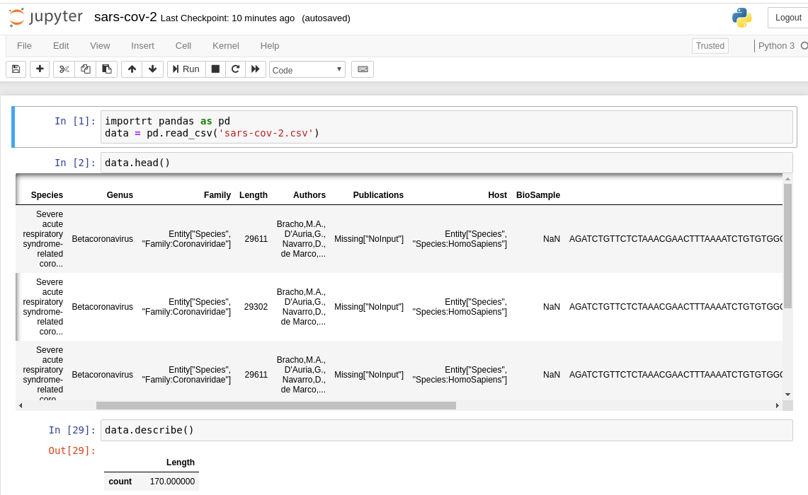

## Data
Download the csv/JSON here and place it in project root  
https://datarepository.wolframcloud.com/resources/Genetic-Sequences-for-the-SARS-CoV-2-Coronavirus

The disease COVID-19 versus the virus SARS-COV-2 that causes it  
https://www.who.int/emergencies/diseases/novel-coronavirus-2019/technical-guidance/naming-the-coronavirus-disease-(covid-2019)-and-the-virus-that-causes-it

Quick Primer on how DNA Translation: DNA -> Amino Acids -> Proteins works  
https://towardsdatascience.com/starting-off-in-bioinformatics-turning-dna-sequences-into-protein-sequences-c771dc20b89f

Viral Genomes
https://www.sciencedirect.com/topics/neuroscience/virus-genome

## Overview
This data set is a table of sars-cov-2 virus samples taken from humans. Swabs samples from the oronasopharynges

This dataset is up to date through March 17th 2020 and provides the country and other useful information regarding the sample.

Each sample vary slightly in their DNA sequence, and hence amino acids formed by that dna sequence.

This data set features the Amino Acids from the sars-cov-2 samples, not Nucleotides.

Let's translate to Proteins!

## Setup
install jupyter

you may need to download pandas

this may make use of matplotlib and numpy

## Run
`jupyter notebook`

Those are the amino acids in the 'Sequence' column, not the nucleotides.

TODO Nucleotides

used:
https://www.geeksforgeeks.org/dna-protein-python-3/

## TODO
- compare wolfram country samples to other country samples - relatedness
- compare to samples from ncbi, see if ncbi samples per country appear in wolfram country samples - relatedness
- Time Parameter - see mutation rate over time

- BioPython
- Trace nucleotides > amino acids > proteins
1. aminoacids
2. proteins
3. relatedness of these in the samples, by country
